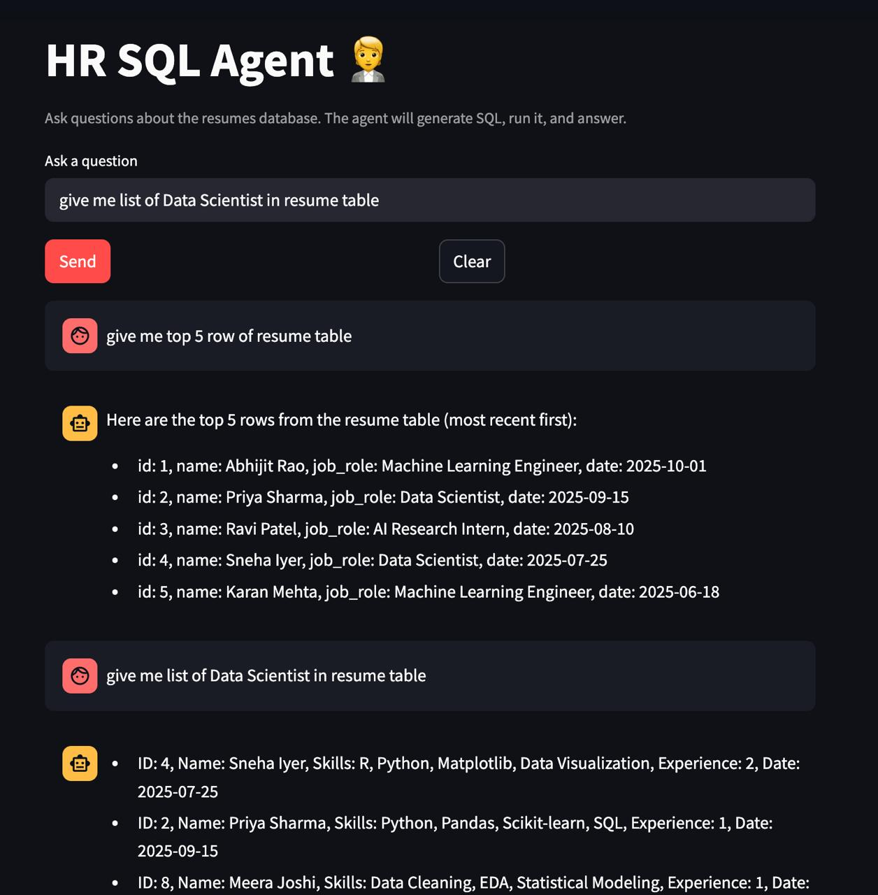

# HR_Agent

Simple HR SQL Agent powered by LangGraph and LLMs. It generates SQL from a natural-language question, executes it on a local SQLite DB (`resume.db`), and returns an answer.

## Features
- Generate syntactically correct SQL from plain English questions
- Execute on a local SQLite database with sample `resume` data
- Streamlit UI for interactive Q&A
- Shows generated SQL and raw results (optional toggle)
- Small, readable codebase using LangGraph nodes

## Quickstart
```bash
# step 1 : clone repo 

# step 2 : uv init 

# step 3 : uv sync 

# step 4 : create .env file 
# step 5 : streamlit run app.py   
```
## Screenshot


## Graph workflow


## Running without Streamlit (dev snippets)
There is a small script in `main.py` you can use while developing:
```bash
python main.py
```
Uncomment the lines in `main.py` to run a one-off question through the graph.

## Environment variables
The LLM is initialized via `langchain.chat_models.init_chat_model("openai:gpt-5")`, which expects `OPENAI_API_KEY`.

Required:
- `OPENAI_API_KEY`: your OpenAI-compatible API key.

Optional:
- `GROQ_API_KEY`: Only referenced in the UI hint; not used by the current `Groqllm` implementation.

Create a `.env` file at project root:
```
OPENAI_API_KEY=sk-...
```

## Project structure
```
HR_Agent/
  app.py                # Streamlit app
  main.py               # Dev script for manual runs
  requirements.txt      # Python deps (uv/pyproject also present)
  README.md
  resume.db             # (root-level) SQLite db (may be created at runtime)
  sql_graph.png         # Generated by graph_img() helper (if used)
  src/
    graph/sqlgraph.py   # LangGraph definition & compile
    nodes/sql_nodes.py  # write_query -> execute_query -> generate_answer
    llms/groqllm.py     # LLM wrapper using init_chat_model("openai:gpt-5")
    prompts/sys_msg.py  # SQL generation prompt
    sqlData/data.py     # SQLite schema + SQLDatabase wrapper
    state/sqlState.py   # TypedDict state
```

## How it works
- `src/graph/sqlgraph.py` builds a simple 3-node graph:
  1. `write_query` uses the prompt in `sys_msg.py` and the DB schema to produce SQL.
  2. `execute_query` runs the SQL against SQLite via `QuerySQLDatabaseTool`.
  3. `generate_answer` uses the LLM to summarize an answer from the SQL result.
- `app.py` wires a minimal Streamlit UI on top, caches the graph, ensures the demo DB exists, and displays chat history. It also has a toggle to reveal the generated SQL and raw result for the last question.

## Database
There are two relevant paths in this project:
- Root-level `resume.db` used by `app.py` for quick existence checks and creation.
- `src/sqlData/resume.db` used by `SQLData.get_data()` via `SQLDatabase.from_uri("sqlite:///src/sqlData/resume.db")`.

On first run, if `resume.db` is missing at the project root, `app.py` attempts to call `SQLData().create_data()` to create and seed a root-level DB. The query execution, however, points to `src/sqlData/resume.db`. If you want both to be the same file, either:
- Change `SQLDatabase.from_uri` to point to the root DB (`sqlite:///resume.db`), or
- Change the creation path in `create_data()` to write into `src/sqlData/resume.db`.

Current seed schema (see `src/sqlData/data.py`):
```sql
CREATE TABLE IF NOT EXISTS resume (
  id INTEGER PRIMARY KEY AUTOINCREMENT,
  name TEXT NOT NULL,
  skills TEXT,
  experience INTEGER,
  job_role TEXT,
  date DATE
);
```
The seeding inserts 10 example rows covering varied roles, skills, and experience.

## Customization
- Model: update `src/llms/groqllm.py` to switch model/provider (e.g., native Groq or OpenAI). It currently uses `init_chat_model("openai:gpt-5")` and reads `OPENAI_API_KEY`.
- Prompt: adjust `src/prompts/sys_msg.py` for SQL generation guidance (dialect, top_k, schema, etc.).
- Graph: add nodes/edges in `src/graph/sqlgraph.py` to extend capabilities (e.g., tool-augmented validation or retry on SQL errors).

## Troubleshooting
- No answer returned / empty response:
  - Ensure `OPENAI_API_KEY` is set in `.env` and exported in your shell.
  - Verify the model string in `groqllm.py` is valid for your environment.
- Database errors (no such table / file):
  - Make sure the DB file used by the graph aligns with where `create_data()` writes it. Consider unifying both paths as noted above.
  - Recreate the DB: open a Python shell and run:
    ```python
    from src.sqlData.data import SQLData
    SQLData().create_data()
    ```
- Streamlit cannot import modules:
  - The app adds the repository root to `sys.path` at startup; ensure you run `streamlit run app.py` from the project root.

## Acknowledgements
- Built with LangGraph, LangChain, and Streamlit.
- SQL utilities from `langchain_community`.

