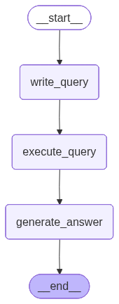

# HR_Agent

Simple HR SQL Agent powered by LangGraph and Groq. It generates SQL from a natural language question, executes it on a local SQLite DB (`resume.db`), and returns an answer.

## Run the Streamlit app

1. Install dependencies
2. Set your Groq API key
3. Launch Streamlit

Commands (zsh):

```bash
# 1) Install deps
pip install -r requirements.txt

# 2) Export API key
export GROQ_API_KEY="your_key_here"

# 3) Run app
streamlit run app.py
```
## Graph workflow 

Then open the provided local URL in your browser. Type a question like:

- How many rows are there?
- List names of candidates with 2 years of experience.

## Notes

- The agent uses `langgraph` to orchestrate nodes that write SQL, execute it, and generate a final answer.
- If you need to re-create the sample DB, see `src/sqlData/data.py` and its `create_data()` function.
